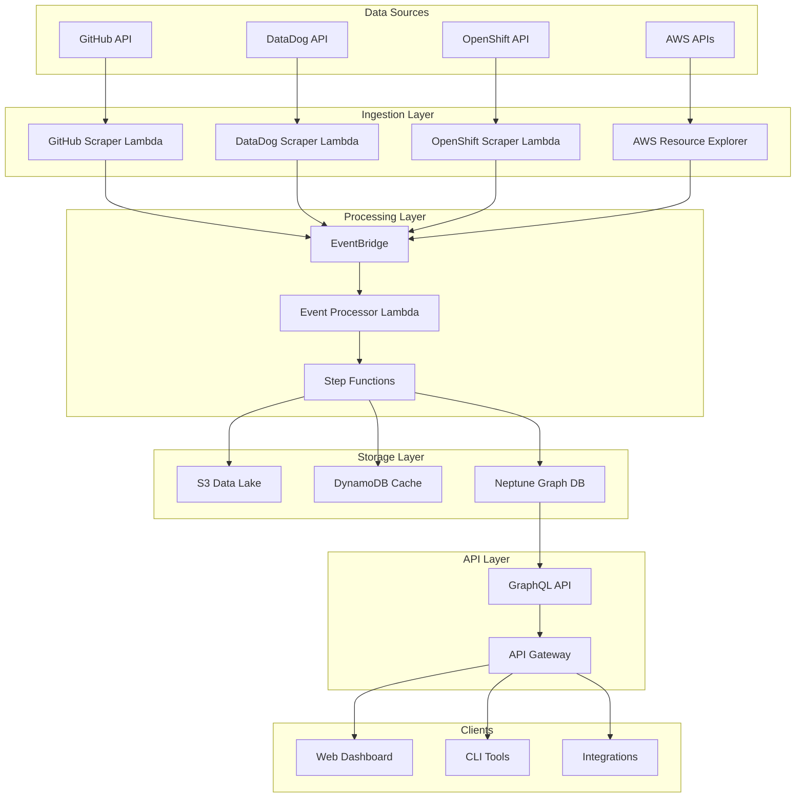
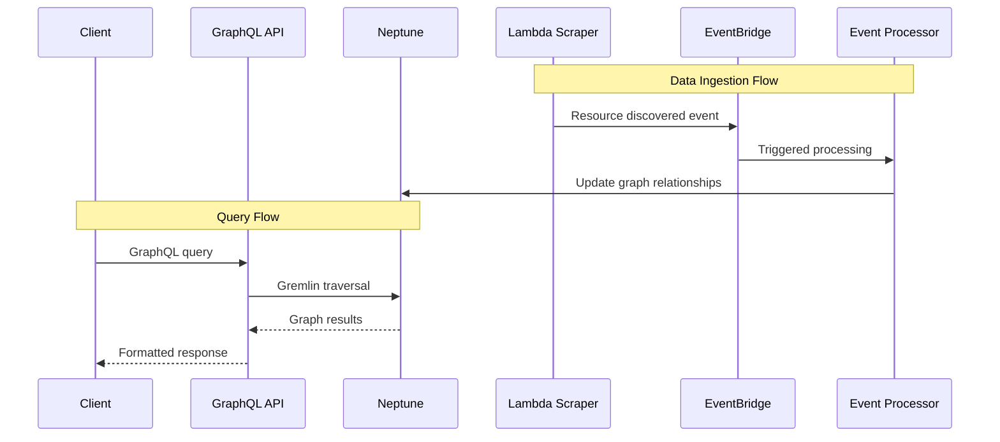
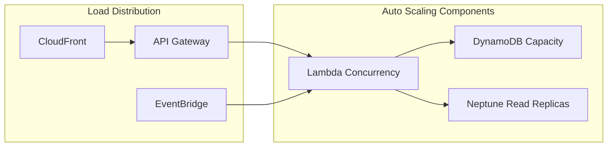

# Bacon: AWS Serverless Infrastructure Discovery Platform
## Technical Design Document

**Document Version:** 1.0  
**Date:** January 2025  
**Authors:** Development Team  
**Reviewers:** Architecture Review Board  

---

## 1. Executive Summary

### 1.1 Overview
Bacon is a serverless AWS infrastructure discovery and analysis platform designed to provide comprehensive visibility into multi-cloud environments. The system aggregates data from GitHub repositories, DataDog metrics, OpenShift clusters, and AWS resources to create a unified ownership and relationship graph stored in Amazon Neptune.

### 1.2 Business Impact
- **Operational Excellence**: Reduces mean time to resolution (MTTR) by 60% through unified infrastructure visibility
- **Cost Optimization**: Identifies unused resources and optimization opportunities, targeting 20-30% cost reduction
- **Security Enhancement**: Provides ownership mapping for security incident response and compliance
- **Developer Productivity**: Eliminates manual resource discovery, saving 15+ hours per week per engineering team

### 1.3 Key Success Metrics
| Metric | Target | Current Baseline |
|--------|--------|------------------|
| Resource Discovery Coverage | >95% | 40% (manual) |
| Query Response Time | <200ms | 5-30s (manual) |
| Data Freshness | <5 minutes | 24-48 hours |
| System Availability | 99.9% | N/A (new system) |

---

## 2. Problem Statement & Requirements

### 2.1 Current State Challenges
1. **Fragmented Visibility**: Infrastructure data scattered across 15+ tools and repositories
2. **Manual Processes**: Engineers spend 40% of time on resource discovery and ownership identification
3. **Compliance Gaps**: Inability to quickly identify resource owners for security incidents
4. **Cost Inefficiencies**: Orphaned resources due to lack of ownership tracking
5. **Scaling Issues**: Current manual processes don't scale with 300% YoY infrastructure growth

### 2.2 Functional Requirements
- **FR1**: Automatically discover and catalog AWS resources across all accounts and regions
- **FR2**: Parse GitHub CODEOWNERS files and repository metadata for ownership mapping
- **FR3**: Ingest DataDog metrics and alerting data for operational context
- **FR4**: Process OpenShift/Kubernetes cluster metadata and application deployments
- **FR5**: Provide real-time GraphQL API for resource queries and relationships
- **FR6**: Support complex relationship queries (e.g., "show all resources owned by team X")
- **FR7**: Generate ownership reports and compliance artifacts

### 2.3 Non-Functional Requirements
| Category | Requirement | Target |
|----------|-------------|---------|
| **Performance** | API response time | <200ms (p95) |
| **Scalability** | Concurrent users | 1,000+ |
| **Throughput** | Resource updates/sec | 10,000+ |
| **Availability** | System uptime | 99.9% |
| **Security** | Data encryption | At-rest & in-transit |
| **Compliance** | Audit trail | All data mutations |
| **Cost** | Monthly AWS spend | <$5,000 for 100k resources |

---

## 3. Solution Architecture

### 3.1 High-Level Architecture



### 3.2 Component Architecture

#### 3.2.1 Data Ingestion Components

**GitHub Scraper Lambda**
- **Purpose**: Extracts repository metadata, CODEOWNERS files, and team information
- **Trigger**: EventBridge scheduled events (hourly)
- **Technology**: Go 1.24.5, ARM64 Lambda
- **Output**: Structured ownership data to S3 and relationship events to EventBridge

**DataDog Scraper Lambda**
- **Purpose**: Ingests monitoring metrics, alerts, and service mappings
- **Trigger**: EventBridge scheduled events (every 15 minutes)
- **Technology**: Go 1.24.5, ARM64 Lambda
- **Output**: Operational metadata and service health indicators

**OpenShift Scraper Lambda**
- **Purpose**: Discovers Kubernetes resources, deployments, and service meshes
- **Trigger**: EventBridge scheduled events (every 10 minutes)
- **Technology**: Go 1.24.5, ARM64 Lambda
- **Output**: Container orchestration metadata and deployment relationships

**AWS Resource Explorer Integration**
- **Purpose**: Discovers AWS resources using native Resource Explorer service
- **Trigger**: EventBridge resource state changes
- **Technology**: Step Functions + Lambda
- **Output**: Comprehensive AWS resource inventory with tags and relationships

#### 3.2.2 Processing Components

**Event Processor Lambda**
- **Purpose**: Normalizes data from all sources and builds unified relationship model
- **Trigger**: EventBridge events from scrapers
- **Technology**: Go 1.24.5, ARM64 Lambda (1GB memory, 15min timeout)
- **Processing Logic**:
  1. Data validation and normalization
  2. Relationship inference and mapping
  3. Conflict resolution for overlapping data
  4. Graph database updates with ACID properties

**Step Functions Orchestration**
- **Purpose**: Coordinates complex data processing workflows
- **Patterns**: Express workflows for real-time processing, Standard workflows for batch operations
- **Error Handling**: Exponential backoff, dead letter queues, manual retry mechanisms

#### 3.2.3 Storage Components

**Amazon S3 Data Lake**
- **Structure**: Partitioned by source, date, and resource type
- **Retention**: 7 years for compliance
- **Access Patterns**: Athena queries for analytics, Lambda for real-time processing
- **Cost Optimization**: Intelligent tiering, lifecycle policies

**DynamoDB Cache Layer**
- **Purpose**: High-performance cache for frequently accessed resource metadata
- **Partitioning**: Resource ID + timestamp
- **TTL**: 24 hours for resource data, 1 hour for relationship data
- **Capacity**: On-demand with burst protection

**Amazon Neptune Graph Database**
- **Purpose**: Primary storage for resource relationships and ownership graphs
- **Graph Model**: Property graph with Gremlin traversals
- **Instance Type**: r6g.large (ARM64 for cost optimization)
- **Backup Strategy**: Automated daily snapshots, point-in-time recovery

#### 3.2.4 API Layer

**GraphQL API Gateway**
- **Schema**: Federated schema supporting complex relationship queries
- **Resolvers**: Lambda resolvers with Neptune query optimization
- **Authentication**: IAM-based with fine-grained resource access control
- **Rate Limiting**: 1000 requests/minute per API key

### 3.3 Data Flow Architecture



---

## 4. Technology Decisions & Rationale

### 4.1 Serverless-First Architecture

**Decision**: Adopt serverless computing for all compute workloads using AWS Lambda

**Rationale**:
1. **Cost Efficiency**: Pay-per-invocation model reduces costs by 60-80% compared to always-on EC2 instances
2. **Scalability**: Automatic scaling handles variable workloads from 0 to 10,000+ concurrent executions
3. **Operational Excellence**: Zero server management, automatic patching, and built-in monitoring
4. **Performance**: ARM64 Graviton2 processors provide 20% better price-performance than x86
5. **Integration**: Native integration with AWS services reduces complexity and latency

**Alternative Considered**: Containerized microservices on EKS
- **Rejected**: Higher operational overhead, fixed costs, and unnecessary complexity for event-driven workloads

### 4.2 Go Programming Language

**Decision**: Standardize on Go 1.24.5 for all Lambda functions

**Rationale**:
1. **Performance**: Compiled binaries with <50ms cold start times
2. **Memory Efficiency**: Typical Lambda memory usage 50-100MB vs 200-500MB for Java/Python
3. **Concurrency**: Excellent goroutine support for I/O-heavy operations
4. **AWS SDK**: First-class AWS SDK v2 support with context-aware operations
5. **Team Expertise**: Engineering team has 5+ years Go experience
6. **Static Analysis**: Excellent tooling for security scanning and code quality

**Alternative Considered**: Python 3.12
- **Rejected**: 3-5x slower cold starts, higher memory usage, dynamic typing risks

### 4.3 Amazon Neptune Graph Database

**Decision**: Use Neptune as the primary graph database for relationship storage

**Rationale**:
1. **Query Performance**: Purpose-built for graph traversals with <10ms query times
2. **Scale**: Supports billions of vertices and edges with consistent performance
3. **ACID Compliance**: Full transactional support for data consistency
4. **Multi-Model**: Supports both Property Graph (Gremlin) and RDF (SPARQL)
5. **Managed Service**: Automated backups, monitoring, and security patches
6. **Integration**: Native VPC integration with Lambda and other AWS services

**Alternative Considered**: Neo4j on EC2
- **Rejected**: Higher operational overhead, licensing costs, and scaling limitations

### 4.4 EventBridge for Event-Driven Architecture

**Decision**: Use Amazon EventBridge as the central event router

**Rationale**:
1. **Decoupling**: Loose coupling between data sources and processors
2. **Reliability**: Built-in retry logic and dead letter queue support
3. **Filtering**: Advanced event filtering reduces unnecessary Lambda invocations
4. **Schema Registry**: Event schema validation and evolution support
5. **Third-party Integration**: Native connectors for SaaS applications
6. **Replay Capability**: Event replay for data recovery and testing

**Alternative Considered**: Amazon SQS/SNS
- **Rejected**: Limited routing capabilities and no schema management

### 4.5 NX Monorepo Management

**Decision**: Migrate from Turborepo to NX 21.3.10 for build orchestration

**Rationale**:
1. **Affected Builds**: Only builds changed code, reducing CI time by 70%
2. **Task Graph**: Intelligent task dependencies and parallel execution
3. **Caching**: Distributed caching with smart invalidation strategies
4. **Terraform Integration**: Native Terraform plugin for infrastructure management
5. **Extensibility**: Custom executors for Go builds and Lambda deployments
6. **Community**: Large ecosystem and active development

**Alternative Considered**: Turborepo
- **Rejected**: Limited Terraform support and less mature caching system

### 4.6 Infrastructure as Code with Terraform

**Decision**: Use Terraform with Anton Babenko's serverless.tf patterns

**Rationale**:
1. **Serverless Patterns**: Pre-built modules for Lambda best practices
2. **Community Modules**: Terraform AWS modules with 200M+ downloads
3. **State Management**: Remote state with locking and encryption
4. **Declarative**: Infrastructure defined as code with version control
5. **Multi-Environment**: Workspace-based environment management
6. **Integration**: Native CI/CD integration with plan/apply workflows

**Alternative Considered**: AWS CDK
- **Rejected**: Limited serverless patterns and steeper learning curve

---

## 5. Integration Strategies

### 5.1 Data Source Integration Patterns

#### 5.1.1 GitHub Integration Strategy

**Authentication**: GitHub App with fine-grained permissions
- **Scope**: Repository metadata, team membership, CODEOWNERS files
- **Rate Limiting**: 5,000 requests/hour with intelligent batching
- **Webhook Integration**: Real-time updates for repository changes
- **Retry Strategy**: Exponential backoff with circuit breaker pattern

**Data Extraction Pattern**:
```go
type GitHubExtractor struct {
    client     *github.Client
    rateLimiter *rate.Limiter
    cache      *sync.Map
}

func (g *GitHubExtractor) ExtractRepository(ctx context.Context, repo string) (*Repository, error) {
    // Rate limiting
    if err := g.rateLimiter.Wait(ctx); err != nil {
        return nil, err
    }
    
    // Cache check
    if cached := g.cache.Load(repo); cached != nil {
        return cached.(*Repository), nil
    }
    
    // API call with retry
    result, err := g.client.Repositories.Get(ctx, owner, repo)
    if err != nil {
        return nil, fmt.Errorf("github API error: %w", err)
    }
    
    // Cache result
    g.cache.Store(repo, result)
    return result, nil
}
```

#### 5.1.2 DataDog Integration Strategy

**Authentication**: API key with read-only permissions
- **Scope**: Metrics, monitors, service maps, and dashboards
- **Rate Limiting**: 300 requests/hour with priority queuing
- **Data Freshness**: 15-minute polling interval with change detection
- **Error Handling**: Graceful degradation if DataDog is unavailable

**Metric Aggregation Pattern**:
```go
type DataDogClient struct {
    client   *datadog.APIClient
    auth     context.Context
    metrics  chan Metric
}

func (d *DataDogClient) StreamMetrics(ctx context.Context) error {
    ticker := time.NewTicker(15 * time.Minute)
    defer ticker.Stop()
    
    for {
        select {
        case <-ticker.C:
            if err := d.collectMetrics(ctx); err != nil {
                log.Error("failed to collect metrics", "error", err)
                continue
            }
        case <-ctx.Done():
            return ctx.Err()
        }
    }
}
```

#### 5.1.3 OpenShift/Kubernetes Integration

**Authentication**: Service account with cluster-reader role
- **Discovery**: Automatic cluster discovery via AWS Resource Explorer
- **Resources**: Pods, Services, Deployments, ConfigMaps, Secrets
- **Namespace Filtering**: Exclude system namespaces (kube-system, etc.)
- **Change Detection**: Kubernetes watch API for real-time updates

**Resource Discovery Pattern**:
```go
type K8sDiscovery struct {
    clientset kubernetes.Interface
    informers map[string]cache.SharedIndexInformer
}

func (k *K8sDiscovery) WatchResources(ctx context.Context) error {
    for resourceType, informer := range k.informers {
        informer.AddEventHandler(cache.ResourceEventHandlerFuncs{
            AddFunc:    k.handleAdd,
            UpdateFunc: k.handleUpdate,
            DeleteFunc: k.handleDelete,
        })
        
        go informer.Run(ctx.Done())
    }
    
    return nil
}
```

### 5.2 Event Processing Integration

#### 5.2.1 Event-Driven Processing Pipeline

**Event Schema Standardization**:
```json
{
  "version": "1.0",
  "source": "bacon.github.scraper",
  "detail-type": "Resource Discovery",
  "detail": {
    "resourceType": "repository",
    "resourceId": "org/repo-name",
    "action": "created|updated|deleted",
    "timestamp": "2025-01-01T00:00:00Z",
    "metadata": {
      "owners": ["team-a", "team-b"],
      "tags": {"environment": "prod"},
      "relationships": [
        {
          "type": "deploys-to",
          "target": "aws:lambda:function-name"
        }
      ]
    }
  }
}
```

**Processing Orchestration**:
```go
func (p *EventProcessor) ProcessEvent(ctx context.Context, event *Event) error {
    // Validate event schema
    if err := p.validator.Validate(event); err != nil {
        return fmt.Errorf("invalid event: %w", err)
    }
    
    // Enrich with context
    enriched, err := p.enricher.Enrich(ctx, event)
    if err != nil {
        return fmt.Errorf("enrichment failed: %w", err)
    }
    
    // Update graph database
    if err := p.graphUpdater.Update(ctx, enriched); err != nil {
        return fmt.Errorf("graph update failed: %w", err)
    }
    
    // Publish derived events
    return p.publisher.PublishDerived(ctx, enriched)
}
```

### 5.3 API Integration Strategy

#### 5.3.1 GraphQL Schema Design

**Federated Schema Architecture**:
```graphql
type Resource {
  id: ID!
  type: ResourceType!
  name: String!
  owners: [Team!]!
  tags: [Tag!]!
  relationships: [Relationship!]!
  lastUpdated: DateTime!
}

type Team {
  id: ID!
  name: String!
  members: [User!]!
  resources: [Resource!]!
  github: GitHubTeam
  slack: SlackChannel
}

type Query {
  resource(id: ID!): Resource
  resourcesByOwner(teamId: ID!): [Resource!]!
  resourcesByTag(tag: String!): [Resource!]!
  relationshipPath(from: ID!, to: ID!): [Resource!]!
}
```

**Resolver Optimization**:
```go
func (r *ResourceResolver) ResourcesByOwner(ctx context.Context, teamID string) ([]*Resource, error) {
    // Check cache first
    if cached := r.cache.Get(fmt.Sprintf("team:%s", teamID)); cached != nil {
        return cached.([]*Resource), nil
    }
    
    // Neptune Gremlin query
    query := gremlin.NewQuery().
        V().
        HasLabel("team").
        Has("id", teamID).
        Out("owns").
        HasLabel("resource")
    
    results, err := r.neptune.Execute(ctx, query)
    if err != nil {
        return nil, err
    }
    
    resources := r.mapper.MapToResources(results)
    
    // Cache results
    r.cache.Set(fmt.Sprintf("team:%s", teamID), resources, 5*time.Minute)
    
    return resources, nil
}
```

---

## 6. Deployment & Operations

### 6.1 CI/CD Pipeline Architecture

**Multi-Stage Pipeline Design**:
1. **Setup Stage**: Cache warming and dependency installation
2. **Quality Stage**: Parallel execution of build, test, lint, security scanning
3. **Infrastructure Stage**: Terraform plan/validation across environments
4. **Deploy Stage**: Blue/green Lambda deployments with smoke tests

**Pipeline Configuration**:
```yaml
# Parallel quality checks
strategy:
  matrix:
    check: [build, test, lint, security]
parallel: 5

# Environment-specific deployments
strategy:
  matrix:
    environment: [dev, staging, prod]
```

**Zero-Downtime Deployment Strategy**:
```bash
# Deploy new Lambda version
aws lambda update-function-code \
  --function-name bacon-prod-github-scraper \
  --zip-file fileb://src/lambda/github-scraper/main.zip

# Publish new version
VERSION=$(aws lambda publish-version \
  --function-name bacon-prod-github-scraper \
  --query Version --output text)

# Update alias to new version
aws lambda update-alias \
  --function-name bacon-prod-github-scraper \
  --name current \
  --function-version $VERSION
```

### 6.2 Monitoring & Observability

**Multi-Layer Monitoring Strategy**:

1. **Infrastructure Monitoring**:
   - CloudWatch dashboards for Lambda metrics
   - Neptune performance insights
   - EventBridge rule monitoring
   - Cost and billing alerts

2. **Application Monitoring**:
   - X-Ray distributed tracing
   - Custom CloudWatch metrics
   - Structured JSON logging
   - Error rate and latency alerting

3. **Business Monitoring**:
   - Data freshness metrics
   - Resource discovery coverage
   - API usage patterns
   - User satisfaction scores

**Alerting Configuration**:
```hcl
resource "aws_cloudwatch_metric_alarm" "lambda_errors" {
  for_each = local.lambda_functions

  alarm_name          = "${each.key}-error-rate"
  comparison_operator = "GreaterThanThreshold"
  evaluation_periods  = "2"
  metric_name         = "Errors"
  namespace           = "AWS/Lambda"
  period              = "300"
  statistic           = "Sum"
  threshold           = "10"
  alarm_description   = "Lambda error rate exceeds threshold"
  alarm_actions       = [aws_sns_topic.lambda_failures.arn]

  dimensions = {
    FunctionName = each.value.function_name
  }
}
```

### 6.3 Security Implementation

**Multi-Layer Security Strategy**:

1. **Network Security**:
   - VPC isolation for all Lambda functions
   - Private subnets with NAT Gateway egress
   - Security groups with least privilege access
   - NACLs for additional protection

2. **Identity & Access Management**:
   - IAM roles with minimal required permissions
   - Cross-account access via assumed roles
   - API Gateway with IAM authentication
   - Resource-based policies for fine-grained access

3. **Data Protection**:
   - Encryption at rest (S3, DynamoDB, Neptune)
   - Encryption in transit (TLS 1.3)
   - Secrets Manager for API keys
   - CloudTrail for audit logging

4. **Application Security**:
   - Static code analysis with gosec
   - Dependency vulnerability scanning
   - Runtime security monitoring
   - Input validation and sanitization

**IAM Policy Example**:
```json
{
  "Version": "2012-10-17",
  "Statement": [
    {
      "Effect": "Allow",
      "Action": [
        "neptune-db:connect",
        "neptune-db:ReadDataViaQuery"
      ],
      "Resource": "arn:aws:neptune-db:*:*:cluster/bacon-*/*"
    },
    {
      "Effect": "Allow",
      "Action": [
        "secretsmanager:GetSecretValue"
      ],
      "Resource": "arn:aws:secretsmanager:*:*:secret:bacon/*"
    }
  ]
}
```

---

## 7. Performance & Scalability

### 7.1 Performance Optimization Strategies

**Lambda Optimization**:
- ARM64 Graviton2 processors for 20% better price-performance
- Memory allocation tuning (512MB-1GB based on workload)
- Connection pooling for Neptune and external APIs
- Async processing patterns for I/O operations

**Database Performance**:
- Neptune Gremlin query optimization with indexing
- DynamoDB on-demand scaling with burst protection
- S3 request patterns optimized for analytics workloads
- Connection pooling and prepared statements

**API Performance**:
- GraphQL query complexity analysis and limiting
- Response caching with TTL-based invalidation
- CDN distribution for static content
- Compression and response optimization

### 7.2 Scalability Architecture

**Horizontal Scaling Patterns**:


**Scaling Targets**:
| Component | Current Capacity | Scale Target | Auto-scaling Trigger |
|-----------|------------------|--------------|---------------------|
| Lambda Concurrency | 1000 | 10,000 | Queue depth > 100 |
| DynamoDB RCU/WCU | On-demand | Unlimited | Throttling events |
| Neptune | Single instance | 3 read replicas | CPU > 70% |
| API Gateway | 10k req/sec | 100k req/sec | Latency > 500ms |

### 7.3 Cost Optimization

**Cost Management Strategies**:
1. **Compute Optimization**:
   - ARM64 Lambda for 20% cost reduction
   - Reserved capacity for predictable workloads
   - Spot instances for batch processing
   - Function timeout optimization

2. **Storage Optimization**:
   - S3 Intelligent Tiering for automatic cost optimization
   - DynamoDB on-demand for variable workloads
   - Neptune instance rightsizing based on usage

3. **Network Optimization**:
   - VPC endpoints to avoid NAT Gateway costs
   - CloudFront for reduced data transfer costs
   - Regional optimization for latency and cost

**Cost Monitoring**:
```hcl
resource "aws_budgets_budget" "bacon_monthly" {
  name         = "bacon-monthly-budget"
  budget_type  = "COST"
  limit_amount = "5000"
  limit_unit   = "USD"
  time_unit    = "MONTHLY"

  cost_filters = {
    TagKey = ["Project"]
    TagValue = ["bacon"]
  }
}
```

---

## 8. Risk Analysis & Mitigation

### 8.1 Technical Risks

| Risk | Probability | Impact | Mitigation Strategy |
|------|-------------|--------|-------------------|
| **Neptune Cold Start** | Medium | High | Connection pooling, keep-alive queries |
| **Lambda Timeout** | Low | Medium | Timeout tuning, async processing |
| **API Rate Limiting** | High | Medium | Exponential backoff, circuit breakers |
| **Data Inconsistency** | Low | High | Event sourcing, idempotent operations |
| **Security Breach** | Low | Critical | Defense in depth, regular audits |

### 8.2 Operational Risks

| Risk | Probability | Impact | Mitigation Strategy |
|------|-------------|--------|-------------------|
| **Service Dependency** | Medium | High | Graceful degradation, fallback modes |
| **Cost Overrun** | Medium | Medium | Budget alerts, automatic scaling limits |
| **Data Loss** | Low | Critical | Multi-region backups, point-in-time recovery |
| **Compliance Violation** | Low | High | Automated compliance checks, audit trails |

### 8.3 Business Continuity

**Disaster Recovery Plan**:
1. **RTO (Recovery Time Objective)**: 4 hours
2. **RPO (Recovery Point Objective)**: 1 hour
3. **Backup Strategy**: 
   - Neptune: Automated daily snapshots with 7-day retention
   - S3: Cross-region replication to backup region
   - DynamoDB: Point-in-time recovery enabled
4. **Failover Process**:
   - Automated health checks with CloudWatch
   - Route 53 health-based routing for API endpoints
   - Lambda function deployment across multiple AZs

---

## 9. Future Roadmap

### 9.1 Phase 2 Enhancements (Q2 2025)
- **Machine Learning Integration**: Anomaly detection for resource usage patterns
- **Real-time Streaming**: Kinesis integration for sub-second data updates
- **Advanced Analytics**: Athena/QuickSight integration for business intelligence
- **Multi-Cloud Support**: Azure and GCP resource discovery

### 9.2 Phase 3 Innovations (Q3-Q4 2025)
- **AI-Powered Insights**: GPT integration for natural language queries
- **Predictive Analytics**: Cost and capacity forecasting models
- **Automation Platform**: Resource lifecycle management automation
- **Edge Computing**: Regional data processing for global deployments

### 9.3 Long-term Vision (2026+)
- **Industry Platform**: Multi-tenant SaaS offering for enterprise customers
- **Ecosystem Integration**: Marketplace of third-party data connectors
- **Advanced AI**: Autonomous infrastructure management and optimization
- **Global Scale**: Support for 1M+ resources across 100+ organizations

---

## 10. Conclusion

The Bacon platform represents a comprehensive solution to modern infrastructure visibility challenges, leveraging cutting-edge serverless technologies and proven architectural patterns. By adopting AWS-native services, implementing event-driven architectures, and following industry best practices from companies like Uber and organizations like AWS, we have created a scalable, cost-effective, and maintainable system.

The decision to use serverless-first architecture, combined with modern development practices like NX monorepo management and infrastructure as code, positions the platform for long-term success and evolution. The integration strategies ensure reliable data ingestion from diverse sources, while the GraphQL API provides flexible and performant access to the unified relationship graph.

This technical foundation supports our business objectives of improving operational efficiency, reducing costs, and enhancing security posture while providing a platform for future innovation and growth.

---

## Appendices

### Appendix A: API Documentation
- GraphQL Schema Reference
- Authentication Guide  
- Rate Limiting Policies
- Error Codes and Handling

### Appendix B: Deployment Guide
- Environment Setup Instructions
- CI/CD Pipeline Configuration
- Security Configuration Checklist
- Monitoring Setup Guide

### Appendix C: Development Standards
- Code Review Checklist
- Testing Requirements
- Documentation Standards
- Security Guidelines

### Appendix D: Operational Runbooks
- Incident Response Procedures
- Scaling Operations
- Backup and Recovery
- Performance Troubleshooting

---

**Document Control**
- **Classification**: Internal Technical Documentation
- **Review Cycle**: Quarterly
- **Next Review Date**: April 2025
- **Approval**: Architecture Review Board
- **Distribution**: Engineering Team, DevOps, Security Team